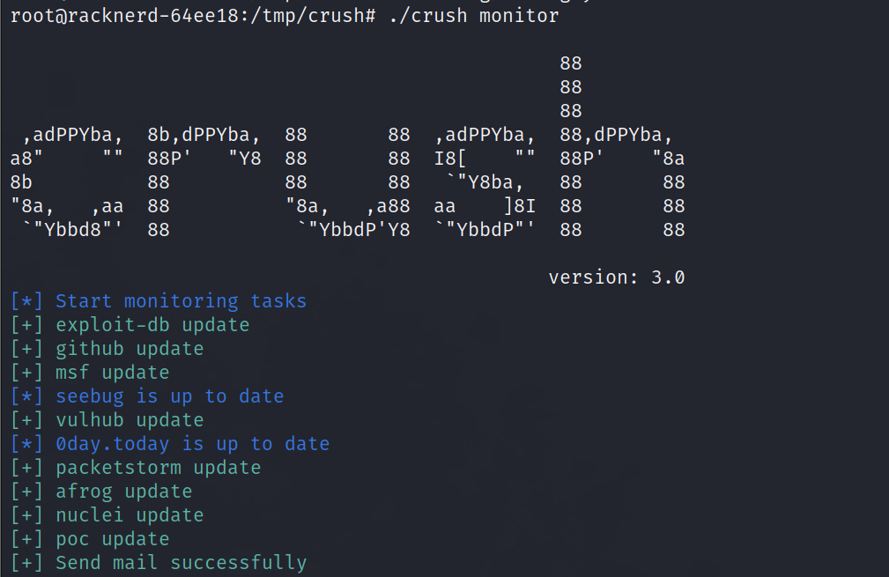
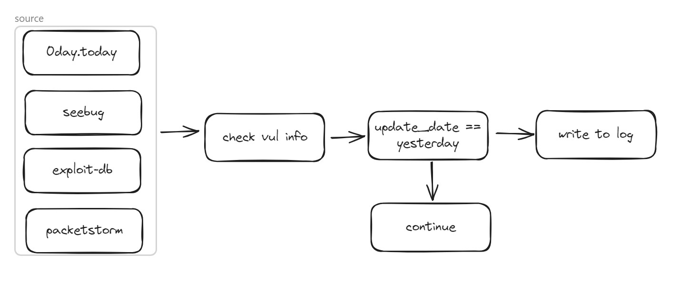
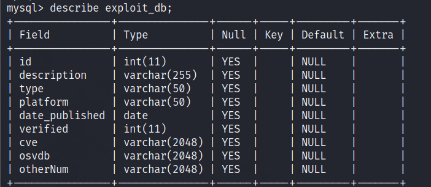
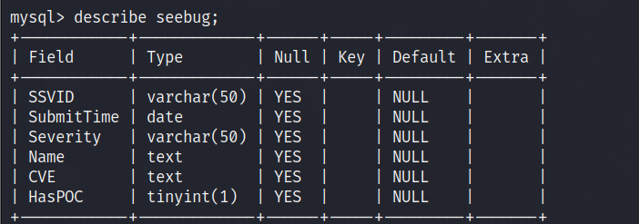
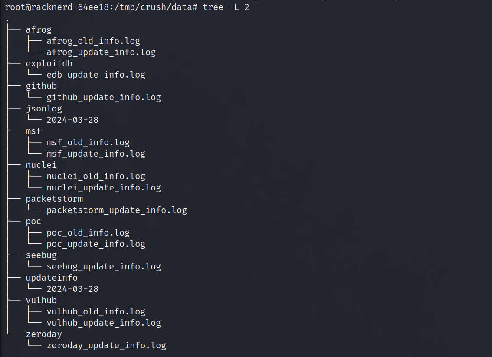
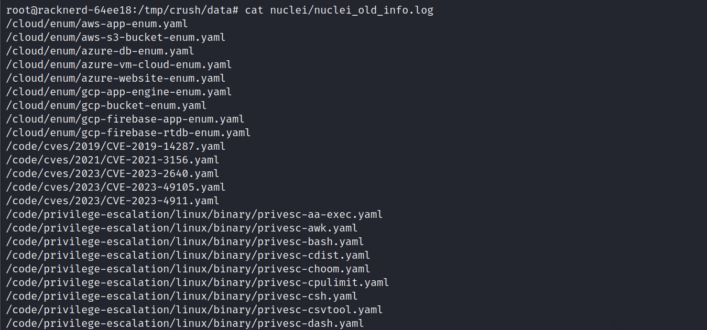
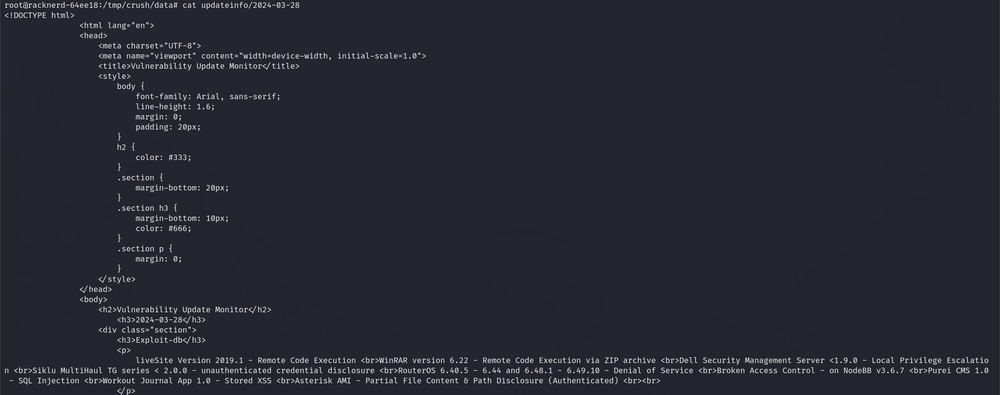
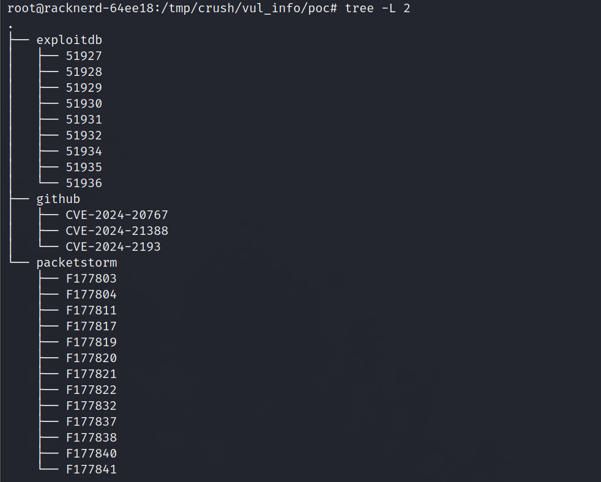

 

## CRUSH - Vulnerability Monitoring Tool

CRUSH is a vulnerability monitoring tool designed to track daily vulnerability updates and send notifications via email.

```
                                                88
                                                88
                                                88
 ,adPPYba,  8b,dPPYba,  88       88  ,adPPYba,  88,dPPYba,
a8"     ""  88P'   "Y8  88       88  I8[    ""  88P'    "8a
8b          88          88       88   `"Y8ba,   88       88
"8a,   ,aa  88          "8a,   ,a88  aa    ]8I  88       88
 `"Ybbd8"'  88           `"YbbdP'Y8  `"YbbdP"'  88       88
```

## 🎯Features

Monitor multiple vulnerability platforms for daily updates, store data in a local database, and send notifications via email.

### Vulnerability Sources

* [x] [Exploit-db](https://www.exploit-db.com)
* [x] [Vulhub](https://github.com/vulhub/vulhub)
* [x] [Github](https://github.com/)
* [x] [Seebug](https://www.seebug.org/vuldb/vulnerabilities?page=1)
* [x] [Metasploit](https://github.com/rapid7/metasploit-framework)
* [x] [0day.today](https://0day.today/) (Added in V2.0)
* [x] [PacketStorm](https://packetstormsecurity.com/files/tags/exploit/) (Added in V2.0)
* [x] [Nuclei](https://github.com/projectdiscovery/nuclei-templates) (Added in V3.0)
* [x] [Afrog](https://github.com/zan8in/afrog) (Added in V3.0)
* [x] [POC](https://github.com/wy876/POC) (Added in V3.0)

## 🪄Installation

The tool can only run on Linux systems. It is recommended to use a VPS overseas to prevent connectivity issues with platforms like GitHub.

### Go

- [Go](https://go.dev/) version 1.20 or higher.

**Github**

```bash
git clone https://github.com/leesinz/crush.git
cd crush
go build
./crush OR go run crush.go
```

## 🔧Configuration

#### config.yaml

```yaml
database:
  db_port: 3306
  db_username: "root"
  db_password: ""
  name: ""

#If downloadPOC is set to false, the poc_dir parameter in GitHub, ExploitDB, and PacketStorm does not need to be configured
poc:
  #whether to download poc
  downloadPOC: false

github:
  github_token: ghp_xxx
  #dir for GitHub PoCs
  poc_dir: "/root/vul_info/poc/github/"
  #github blacklist users
  blacklist:
    - xxx
    - aaa

exploitdb:
  #dir for exploit-db PoCs
  poc_dir: "/root/vul_info/poc/exploitdb/"

packetstorm:
  #dir for packetstorm PoCs
  poc_dir: "/root/vul_info/poc/packetstorm/"	

email:
  smtp_server: smtp.163.com
  smtp_port: 25
  username: test@163.com
  #authentication code
  password: xxx
  from: test@163.com
  to:
    - test1@163.com
    - test2@163.com
```

#### MySQL Configuration

```
sudo apt-get update
sudo apt-get install mysql-server
sudo mysql_secure_installation
```

Set a password and create a database. Synchronize configuration information to `config.yaml`.

If encountering

`Error connecting mysql database:%!(EXTRA *mysql.MySQLError=Error 1698 (28000): Access denied for user 'root'@'localhost', string=)`

reset the password:

`ALTER USER 'root'@'localhost' IDENTIFIED WITH mysql_native_password BY 'newpasswd';`

#### Installing Google Chrome

```bash
wget https://dl.google.com/linux/direct/google-chrome-stable_current_amd64.deb
sudo apt install ./google-chrome-stable_current_amd64.deb
```

Display the version number to confirm successful installation, as follows:

```bash
root@iZt4ndirp1045jgp7cqswkZ:~# google-chrome -version
Google Chrome 121.0.6167.139
```

#### Quick Start

**If unable to set up the project locally, subscribe to the WeChat public account at the end of the document to receive vulnerability update information, which is sent every morning.**

##### Environment Configuration

- Go environment
- MySQL environment
- Configuration of `config.yaml`
- Google Chrome configuration

After configuring, you can start using.


##### Initialization

When using it for the first time, use the `init` parameter to create a database and perform historical data crawling, and other operations.

`./crush init`


**Note the `downloadPOC` parameter in `config.yaml`. If set to `false`, POC files will not be downloaded. If set to `true`, then you need to configure the `poc_dir` parameter under `github`, `exploit-db`, and `packetstorm` in `config.yaml`. This will archive updated POC files to the corresponding directories.**

##### Monitoring Updates

After initialization, subsequent monitoring of updates can be done using the `monitor` parameter, which sends notifications via email for any updates.

`./crush monitor`



**Crontab needs to be configured manually; no scheduling tasks or loops are set in the code.**

For example:

`0 9 * * * cd [crush_path] && /usr/local/go/bin/go run crush.go monitor`

This will send notifications for updates made the previous day at 9 am daily.

##### Importing Historical Data (Optional)

Starting from version 3.0, historical data is no longer crawled. If historical data is needed, it can be imported into the database directly from the `.sql` file (stored in the `sql` folder).

**`exploit_db.sql` and `seebug.sql` contain full historical data. `github.sql` contains CVE data from 2018 to present, with a maximum of five entries per CVE.**

For example, to import data from `exploit-db.sql`, use the following command:

`mysql -u username -p database_name < exploit_db.sql`


## 💡Matching Logic

#### Overall Structure


The crawling logic is divided into three types, as described below.

#### GitHub


#### 0day...



#### Nuclei...


## 😎Demo

#### Email Template


Three new vulnerability sources have been added in V2.0: Nuclei, POC, and Afrog.

For CVE vulnerabilities monitored by GitHub, the CVE number, POC link, vulnerability description, and severity score are displayed. For other sources, only the vulnerability name and CVE number are displayed. To access POC link information, users can visit the respective vulnerability platforms or check the JSON log files in the `data` directory.

#### Database Structure

##### Exploit-db

Contains all attributes stored on the EDB official website:



##### GitHub

Stores CVE numbers, vulnerability descriptions from the NVD website, CVSS2, CVSS3, CNA scores, update times, and POC links:


##### Seebug

Stores official IDs, submission times, vulnerability severity, vulnerability names, CVE numbers, and whether there is a POC:



##### 0day.today

Stores official IDs, vulnerability names, CVE numbers, POC links, and other information:


##### PacketStorm

Stores official IDs, names, CVE numbers, POC links, vulnerability descriptions, etc.:


#### Log Files

Log files are stored in the `data` directory:



`update_info.log` records daily update information for each vulnerability source:


`old_info.log` stores file information from the GitHub repository during the last run:



JSON log files in the `jsonlog` directory store information about updated POCs for specific dates:


HTML-formatted email contents are stored in the `updateinfo` directory:



#### POC Files

After enabling `downloadPOC`, the structure for storing POCs is as follows:



The directories for `exploit-db` and `packetstorm` are named after the vulnerability IDs. For GitHub-monitored vulnerabilities, they are named after CVE numbers. If multiple POCs exist for the same vulnerability, the author's name is used as a subfolder.


## 🎈Version History

- 2024.02.05 V1.0 Initial version
- 2024.03.06 V2.0
  - Added 0day.today and PacketStorm vulnerability sources
- 2024.03.29 V3.0
  - Added Afrog, POC, and Nuclei vulnerability sources
  - Optimized crawling methods for MSF, Vulhub, Afrog, Nuclei, and POC vulnerability sources. Instead of using regular expressions to match, now utilizes GitHub API for traversing contents, eliminating the need to clone repositories locally and reducing storage pressure.
  - Added a `downloadPOC` switch that can be configured in `config.yaml`. If set to `true`, configure the `poc_dir` parameters under `github`, `exploit-db`, and `packetstorm` in `config.yaml`. Updated POC files will be archived to the corresponding directory.
  - Added JSON log files in the `data/jsonlog` directory, which record vulnerability information updates in JSON format, including vulnerability names, CVE numbers, POC links, and sources.

## 🎉Acknowledgments

Special thanks to the following outstanding projects:

[github_cve_monitor](https://github.com/yhy0/github-cve-monitor)

## 🕵️Disclaimer

This tool is only intended for use in enterprise security setups with sufficient legal authorization. You must ensure that all your actions comply with local laws and regulations while using this tool. 
If you engage in any illegal activities while using this tool, you do so at your own risk. The developers and contributors of this tool assume no legal or joint liability.
Unless you have read, fully understood, and accepted all the terms of this agreement, please do not install or use this tool.
Your use of this tool or your express or implied acceptance of this agreement in any other way will be deemed as your complete acceptance of the terms of this agreement.

## ⭐Star History


---

Feel free to let me know if you need any further modifications or assistance!